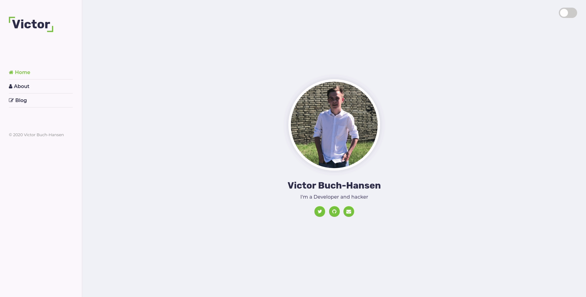
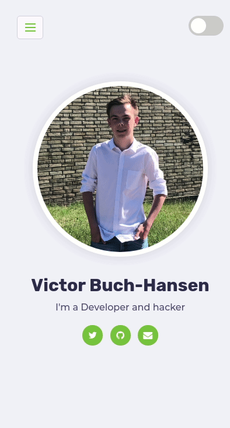

# About
This is the website that should run on `victorbuch.dk` in the future. It is fully open <3 source.
It is still at an early stage and is far from done.

# Color scheme

### Light theme
|Color|Name|
|---|---|
| `#fdf9ff`| --background--light|
| `#f2f2fc`| --background--darker|
| `#302e4d`| --heading|
| `#504e70`| --text|
| `#7d7d7d`| --small-text|
| `#72b626`| --accent-color|
| `#e8dfec`| --borders|

### Dark theme
|Color|Name|
|---|---|
| `#161616`| --background--light|
| `#252525`| --background--darker|
| `#ffffff`| --heading|
| `#e9e9e9`| --text|
| `#7d7d7d`| --small-text|
| `#72b626`| --accent-color|
| `#393939`| --borders|

# Preview

### Desktop

### Mobile

# Contributing
You are welcome to contribute to the project, or fork it and make your own version of it.

# License
This project is licensed under the `GNU General Public License v3.0`